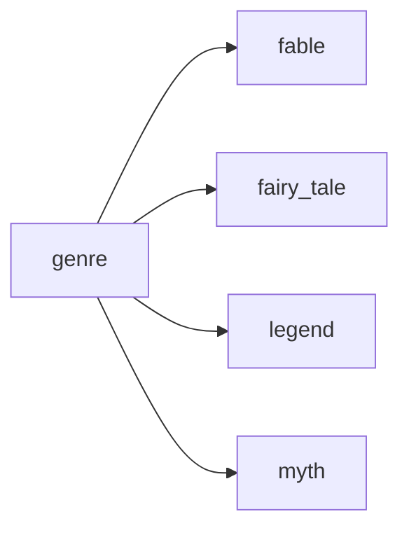
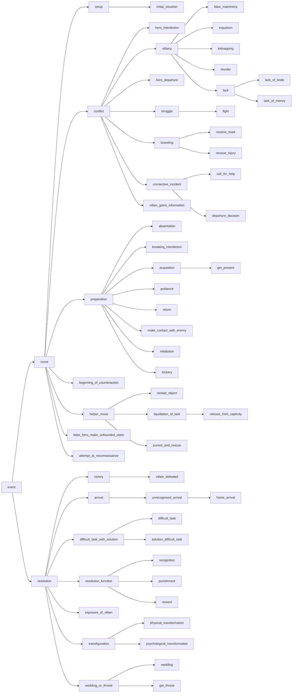
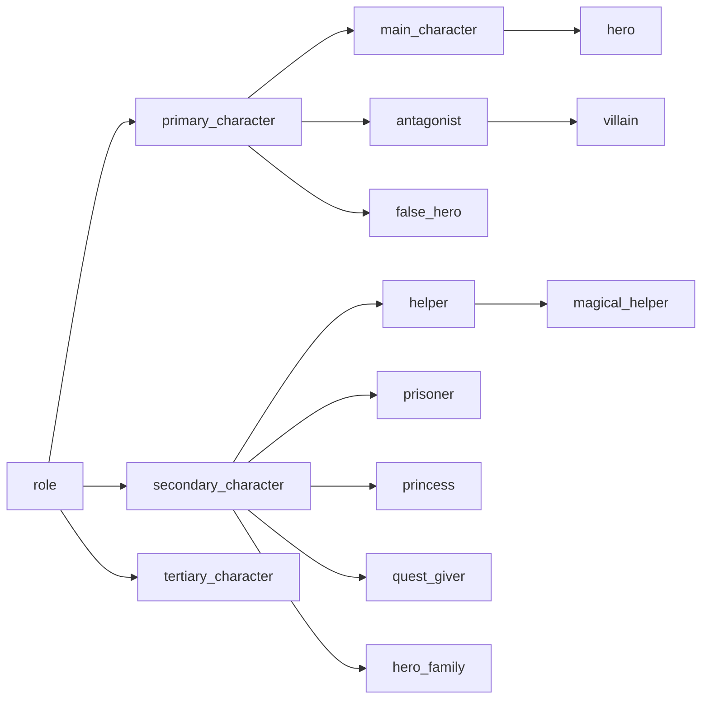
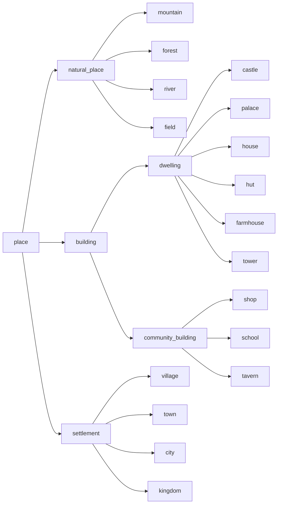
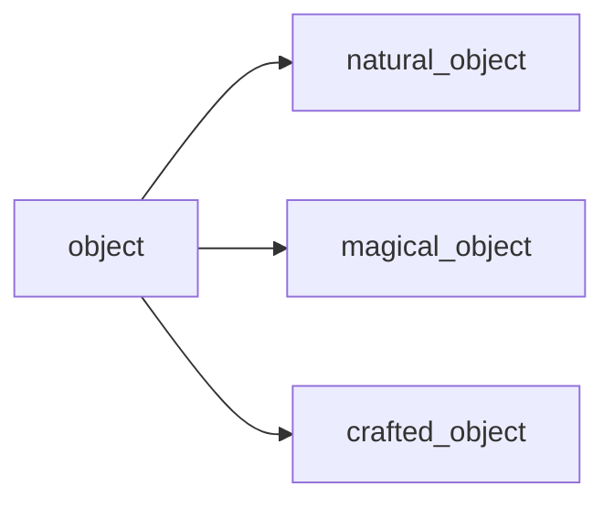

# Anotación y Generación de Cuentos Populares
Este proyecto consiste en la anotación y generación de cuentos populares estructurados a partir de un esquema propio inspirado en las idea de *Morfología del cuento* de Vladimir Propp. 

## Descripción general
El sistema se compone de dos componentes principales:
1. **Anotación de cuentos**
   Permite la anotación automática de cuentos en lenguaje natural mediante un modelo de lenguaje y díferentes técnicas de prompt engineering.

2. **Generación de cuentos**
   Utiliza los cuentos previamente anotados para poblar un grafo de conocimiento, que a través de razonamiento por similitud, el sistema permite crear nuevos cuentos a partir de la recombinación de elementos provenientes de distintos relatos existentes.

## Dataset
Los datos utilizados para la anotación y la construcción del grafo de conocimiento, se han obtenido del siguiente dataset de Kaggle:

- [Folk Tales Dataset - Kaggle](https://www.kaggle.com/datasets/andrzejpanczenko/folk-tales-dataset)

Este conjunto de datos contiene cuentos populares de diversas nacionalidades y tradiciones culturales.

## Instalación
Clona el repositorio y asegúrate de tener `uv` correctamente instalado:

```bash
git clone <url-del-repositorio>
cd <nombre-del-repositorio>
```

## Ejecución
El  proyecto está compuesto por diferentes módulos. Cada uno puede ejecutarse mediante el siguiente comando:
```bash
uv run -m <módulo>.main
```

## Módulos

### `annotation`

Realiza la anotación automática del dataset ubicado en:

```
./data/folk_tales_deduplicated.csv
```

#### Configuración requerida

- Instalar Ollama
- Configurar la variable de entorno:

```bash
export OLLAMA_HOST=http://localhost:11434
```

- Descargar el modelo
```bash
ollama pull llama3.1:8b
```

**Ejecución**
```bash
uv run -m annotation.main
```

### `generation`
Permite generar un nuevo cuento popular a partir de la recombinación de elementos narrativos de distintos cuentos anotados.

#### Configuración requerida
Antes de ejecutar el módulo, hay que modificar el archivo de consulta:
```
./query.json
```

A continuación, se muestra un ejemplo de consulta:
```json
{
    "title": "The Tale of Ralph",
    "events": [
        "initial_situation",
        "villainy",
        "struggle",
        "helper_move"
    ],
    "roles": [
        "hero",
        "antagonist",
        "helper",
        "secondary_character",
    ],
    "objects": [],
    "places": [
        "city"
    ],
    "genre": "legend",
    "max_events": 15
}
```
Cada uno de los parámetros, a excepción del `title` y `max_events`, tienen que corresponder con tipos pertenecientes a sus respectivas clasificaciones. A continuación, se describe cada campo de forma detallada forma detallada. Además, cada uno de ellos actúa como recomendaciones y no como restricciones estrictas.
- `title`: Nombre del cuento generado.
- `events`: Secuencia ordenada de tipos eventos que deberían aparecer en el cueneto.
- `roles`: Tipos de roles de personajes que deberían aparecer en la historia.
- `objetos`: Tipos de objetos que al usuario le gustaría que aparecieran en el cuento.
- `places`: Tipos de lugares que al usuario le gustaría que estuvieran en el cuento.
- `genre`: Tipo del nuevo cuento.
- `max_events`: Número máximo recomendado de eventos por el que debería estar formado el relato.

Además, es necesario configurar la variable de entorno `GROQ_CLOUD` con el secreto de [Groq Cloud](https://console.groq.com/home):
```bash
export GROQ_CLOUD=<tu_api_key>
```

**Ejecución**
```bash
uv run -m generation.main
```

**Salida**

Los cuentos generados se almacenan en:
```
./generation/out
```

**Experimentos**

Dentro de este módulo puede ejecutarse el submódulo `experiments`, que realiza una evaluación *leave-one-out* para comprobar si el sistema es capaz de generar cuentos similares a los siguientes relatos anotados manualmente:
- *Cenicienta*
- *La liebre y la tortuga*
- *Los tres cerditos*

### `common`
Muestra información y estadísticas generales sobre los cuentos anotados.

**Ejecución**
```bash
uv run -m common.main
```

## Estructura del proyecto
```kotlin
.
├── annotation/
├── generation/
│   ├── experiments/
│   └── out/
|       ├── annotated/
|       └── raw/
├── common/
├── data/
│   └── folk_tales_deduplicated.csv
├── query.json
└── README.md
```

## Taxonomías
A continuación, se muestran las diferentes taxonomías, necesarias para definir una consulta al momento de generar un cuento.

### Género
Define el tipo del cuento.


### Eventos
Describe los tipos de evento, que se basan en las 31 funciones de Propp. De manera general, se dividen en `move`, que representa el desarrollo de la trama principal, y `resolution`, que corresponde a la resolución del conflicto.


### Roles
Describe las funciones que cumplen los personajes dentro de la historia, tomando como referencia las 7 esferas de acción de Propp.


### Lugares
Especifica los distintos escenarios que pueden aparecer en un cuento, incluyendo tanto los entornos naturales como los creados por el ser humano.


### Objetos
Define los distintos objetos que pueden aparecer en un cuento, destacando los objetos mágicos, característicos de este tipo de narrativa.

