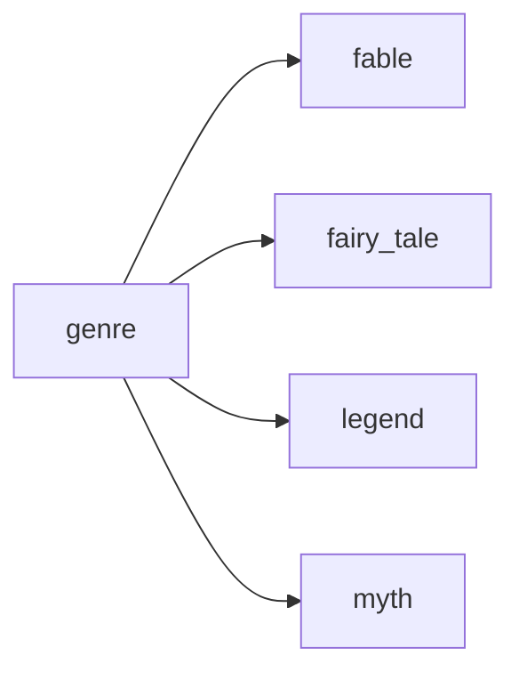
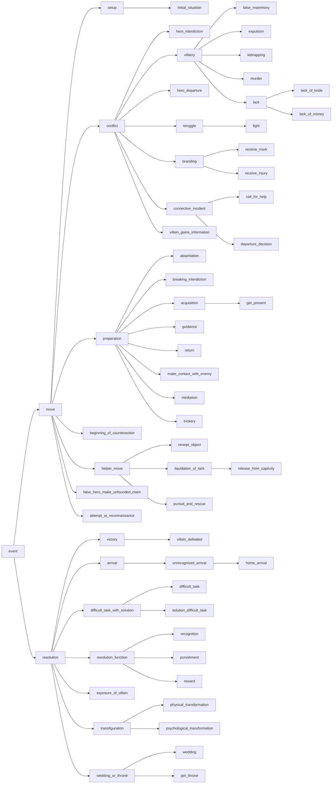
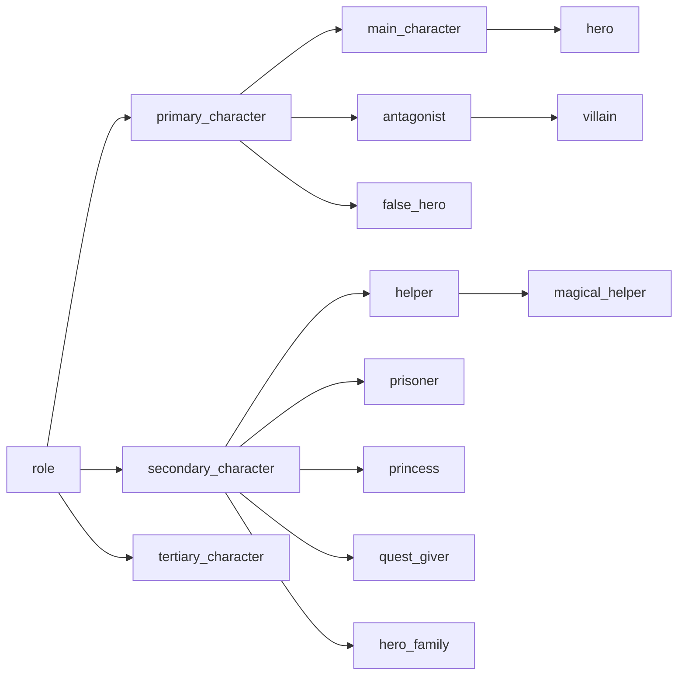
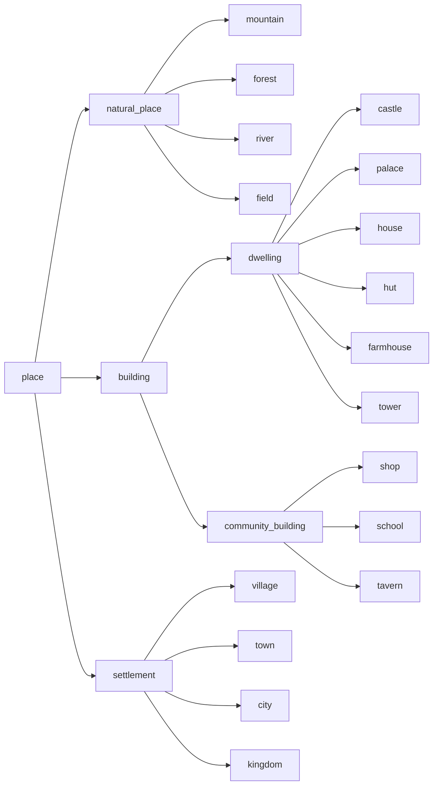
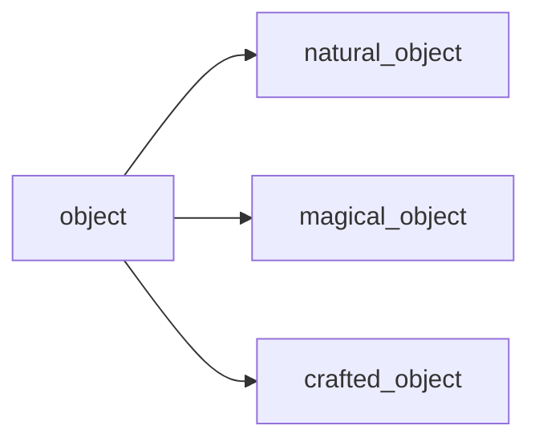

# Anotación y Generación de Cuentos Populares

## Género

```mermaid
graph LR
    genre --> fable
    genre --> fairy_tale
    genre --> legend
    genre --> myth
```

## Eventos

```mermaid
graph LR
    event --> move
    move --> setup
    setup --> initial_situation

    move --> conflict
    conflict --> hero_interdiction
    conflict --> villainy

    villainy --> false_matrimony
    villainy --> expulsion
    villainy --> kidnapping
    villainy --> murder
    villainy --> lack
    lack --> lack_of_bride
    lack --> lack_of_money

    conflict --> hero_departure

    conflict --> struggle
    struggle --> fight

    conflict --> branding
    branding --> receive_mark
    branding --> receive_injury

    conflict --> connective_incident

    connective_incident --> call_for_help
    connective_incident --> departure_decision

    conflict --> villain_gains_information

    move --> preparation
    preparation --> absentation
    preparation --> breaking_interdiction
    preparation --> acquisition
    acquisition --> get_present
    preparation --> guidance
    preparation --> return
    preparation --> make_contact_with_enemy
    preparation --> mediation
    preparation --> trickery

    move --> beginning_of_counteraction

    move --> helper_move
    helper_move --> receipt_object
    helper_move --> liquidation_of_lack
    liquidation_of_lack --> release_from_captivity
    helper_move --> pursuit_and_rescue

    move --> false_hero_make_unfounded_claim
    move --> attempt_at_reconnaissance

    event --> resolution
    resolution --> victory
    victory --> villain_defeated

    resolution --> arrival
    arrival --> unrecognised_arrival
    unrecognised_arrival --> home_arrival

    resolution --> difficult_task_with_solution
    difficult_task_with_solution --> difficult_task
    difficult_task_with_solution --> solution_difficult_task

    resolution --> resolution_function
    resolution_function --> recognition
    resolution_function --> punishment
    resolution_function --> reward

    resolution --> exposure_of_villain

    resolution --> transfiguration
    transfiguration --> physical_transformation
    transfiguration --> psychological_transformation

    resolution --> wedding_or_throne
    wedding_or_throne --> wedding
    wedding_or_throne --> get_throne
```

## Roles

```mermaid
graph LR
    role --> primary_character
    role --> secondary_character
    role --> tertiary_character

    primary_character --> main_character
    primary_character --> antagonist
    primary_character --> false_hero

    main_character --> hero
    antagonist --> villain

    secondary_character --> helper
    helper --> magical_helper

    secondary_character --> prisoner
    secondary_character --> princess
    secondary_character --> quest_giver
    secondary_character --> hero_family
```

## Lugares

```mermaid
graph LR
    place --> natural_place
    natural_place --> mountain
    natural_place --> forest
    natural_place --> river
    natural_place --> field

    place --> building
    building --> dwelling
    dwelling --> castle
    dwelling --> palace
    dwelling --> house
    dwelling --> hut
    dwelling --> farmhouse
    dwelling --> tower

    building --> community_building
    community_building --> shop
    community_building --> school
    community_building --> tavern

    place --> settlement
    settlement --> village
    settlement --> town
    settlement --> city
    settlement --> kingdom
```

## Objetos

```mermaid
graph LR
    object --> natural_object
    object --> magical_object
    object --> crafted_object
```
